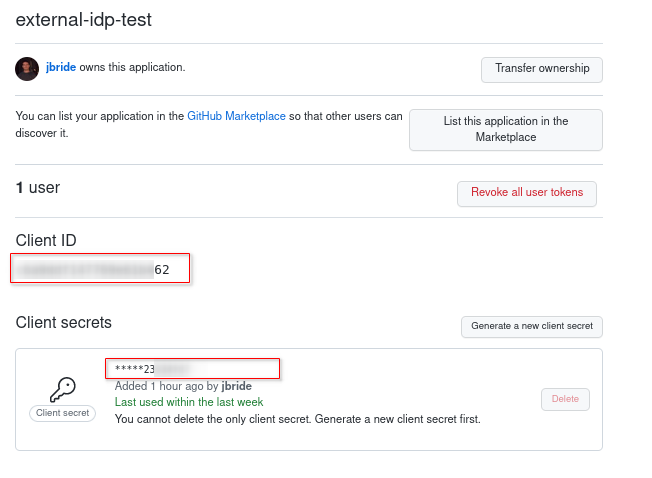

:scrollbar:
:data-uri:
:toc2:
:linkattrs:

= Sepsis Detection Demo
:numbered:

== Overview

== Pre-reqs
. _OpenShift_ cluster ( >= v 4.10 )
+
The cluster should have about 6 GBs and 6 CPUs to allocate to the resources of this quickstart.

. link:https://mirror.openshift.com/pub/openshift-v4/clients/ocp/?C=M;O=D[oc utility]
+
Needs to correspond to the version of your OpenShift cluster.
+
You should be authenticated into your OpenShift cluster at the command line as a `cluster-admin` user.

. *ansible*
+
Installed locally with the following collections:

.. link:https://docs.ansible.com/ansible/latest/collections/kubernetes/core/index.html[kubernetes]

... Install: 
+
-----
$ ansible-galaxy collection install kubernetes.core
-----

... Test:
+
-----
$ ansible-doc -t module kubernetes.core.helm
-----
+
You should see output similar to the following: 
+
-----
> KUBERNETES.CORE.HELM    (/usr/lib/python3.8/site-packages/ansible_collections/kubernetes/core/plugins/modules/helm.py)

        Install, upgrade, delete packages with the Helm package
        manager.

ADDED IN: version 0.11.0 of kubernetes.core
...
-----

.. link:https://docs.ansible.com/ansible/5/collections/community/general/docsite/filter_guide_selecting_json_data.html[jmespath]
+
ie: On Linux systems, the following steps tend to work: 

... Check version of python used by ansible:
+
-----
$ ansible --version

ansible [core 2.12.2]
  ...

  python version = 3.8.12 (default, Sep 16 2021, 10:46:05) [GCC 8.5.0 20210514 (Red Hat 8.5.0-3)]

  ...

-----
... Using the version of python leveraged by ansible, install dependency as root user:
+
-----
# python3.8 -m pip install jmespath
-----

== Identity Brokering
Keycloak can integrate w/ 3rd party identity providers using a set of open standard protocols.  In particular, Keycloak can act as an intermediary service for authenticating and replicating users from a targeted identity provider.

In this section of the quickstart, _github_ will be used as that targeted identity provider and the protocol used to facilitate that integration will be OpenID Connect.

=== Benefits
Through identity brokering, you can provide a much better experience for users where they can leverage an existing account to authenticate and sign up in your realm.

Once these users have been created and their information has been imported from the third-party provider, they become users of your realm and can enjoy all of the features provided by Keycloak and respect the security constraints imposed by your realm.

=== github OAuth App

In this section, you will create a new OAuth client in github.

. Authenticate into github and navigate to:  `Settings -> Developer settings`.
. Click the `New OAuth App` button.
. Populate the form with the following values:
.. *Application name* : `external-idp-test`
.. *Homepage URL*: `https://github.com/redhat-na-ssa/keycloak_ldap_quickstart`
.. *Authorization callback URL*:  Add any URL ... you'll modify this later.
. Click `Register application`
. In the details page of the new github OAuth App, copy both the `Client ID` as well as the `client secret`
+

. Set needed environment variables: 
+
-----
$ export github_client_id=<changeme>
$ export github_client_secret=<changeme>
-----

== Provisioning

. Change directories into the `ansible` folder:
+
-----
$ cd ansible
-----

. Execute ansible playbook
+
-----
$ ansible-playbook playbooks/install.yml \
    -e github_client_id=$github_client_id \
    -e github_client_secret=$github_client_secret
-----

== Environment Variables

. Set the following environment variables with values similar to the following:
+
-----
export RHSSO_NS=redhat-rhoam-rhsso
export OCP_DOMAIN=apps$(oc whoami --show-console | awk 'BEGIN{FS="apps"}{print $2}')
export RHSSO_HOST=sso-$RHSSO_NS.$OCP_DOMAIN
export RHSSO_URL=https://$RHSSO_HOST/auth
export RHSSO_MASTER_PASSWD=$(oc get secret credential-rhsso -o json -n $RHSSO_NS | jq -r .data.ADMIN_PASSWORD | base64 -d)

export USER_ID=user1
export REALM_ID=$USER_ID-daybreak
export OIDC_TOKEN_URL="$RHSSO_URL/realms/$REALM_ID/protocol/openid-connect/token"
-----
